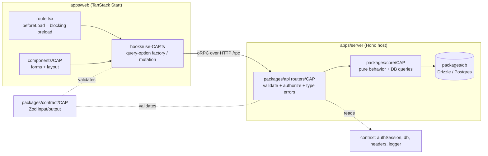
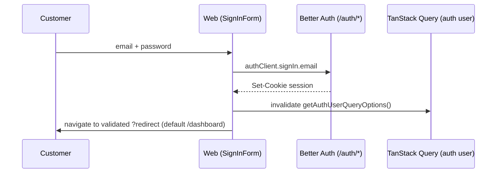
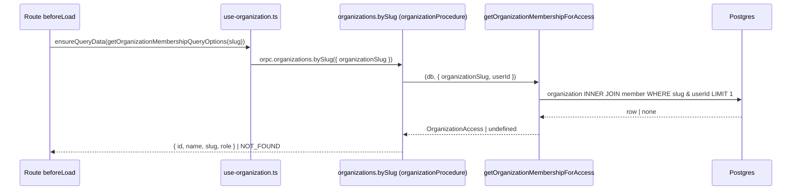
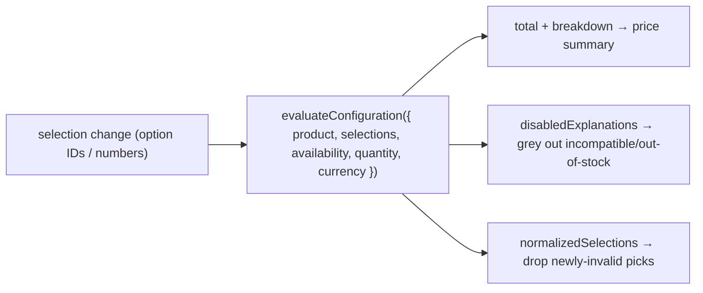
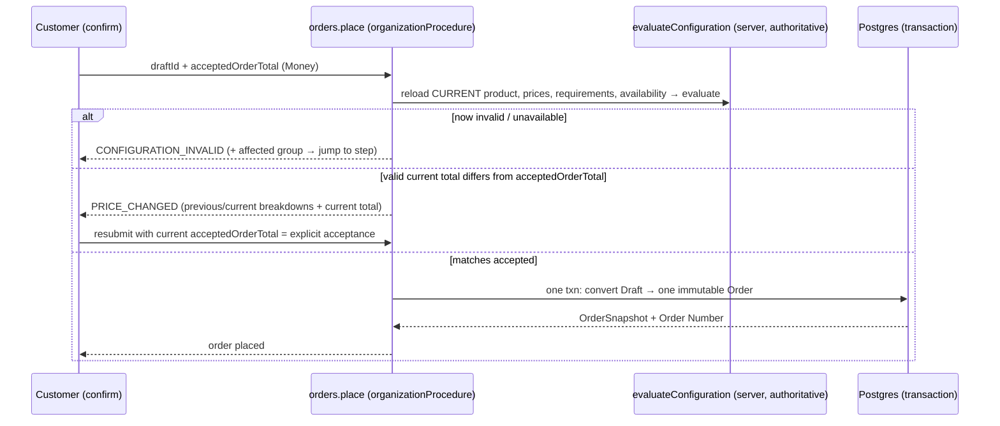

# Customer journey: login → order, and how data is handled

## Question

Walk the customer flow end to end — from login to a placed order — and explain how
data moves through the frontend and backend at each stage.

## Answer (read this first)

The journey splits into two halves on branch `auth-slice-1`:

- **Login → tenant entry is BUILT and traceable in code** — Better Auth email/
  password (public signup disabled), invitation-first account creation, session,
  organization resolution by URL slug, membership + capability checks.
- **Configuration evaluator and contracts are BUILT; customer-facing catalog →
  configure → draft → order remains PLANNED** — Slice 1 is complete, while Slices
  4-10 are not implemented. No customer-facing `catalog`/`drafts`/`orders`/
  `inventory`/`payments`/`products` oRPC routers, routes, tables, or modules exist
  yet
  (`packages/api/src/routers/index.ts` exposes only `health`, `organizations`,
  `private`, `platform`; DB has only `user`/`session`/`account`/`verification`/
  `organization`/`member`/`invitation`/`audit_event`).

Every stage below is tagged **[BUILT]** (with `file:line`) or **[PLANNED]** (with
stable spec section or task references). The _shape_ of data handling is identical across both halves because
they ride the same layered architecture — so the built half is the template the
planned half will follow.

## The one data-flow model (memorize this; every stage is an instance of it)

Album Studio is a layer-sliced, feature-keyed monorepo (`docs/architecture.md:9-27`).
A capability keeps the same name across every layer. Data always moves the same way:

- **Frontend owns UX, never authority.** Routes preload data in `beforeLoad`
  (the active primitive — no `loader:` is used anywhere, per recon). Hooks
  (`use-<cap>.ts`) hold query-option factories + mutations + invalidation. State
  is served by TanStack Query with SSR hydration.
- **Backend owns truth.** Every request builds context `{ authSession, db, headers,
logger }` (`packages/api/src/lib/context/hono/create-context.ts:9-21`). oRPC
  procedures validate (Zod), authorize (middleware), delegate to `packages/core`,
  and translate failures into typed errors. `packages/core` holds pure behavior +
  DB queries and takes a `Database | Transaction` handle rather than opening its
  own connection (`packages/core/src/organization/queries.ts:26-29`).
- **Contracts are the shared vocabulary.** `packages/contract` exports Zod schemas
  and inferred types used on both sides, so the client and server never disagree on
  shape. Contract never imports runtime layers (`docs/architecture.md:26`).
- **Transport.** Hono mounts everything under the `VITE_SERVER_URL` base path
  (default `/server`): `/auth/*` → Better Auth, `/rpc` → oRPC, `/docs` → OpenAPI/
  Scalar (`apps/server/src/index.ts`). The web calls oRPC via an `RPCLink` with
  `credentials: "include"` (`packages/api/src/client/tanstack-start/orpc.ts`).

Five procedure builders enforce the authorization ladder
(`packages/api/src/lib/procedures/factory.ts`):

| Builder                                      | Guarantee                                    |
| -------------------------------------------- | -------------------------------------------- |
| `publicProcedure`                            | no auth                                      |
| `protectedProcedure`                         | valid session or `UNAUTHORIZED`              |
| `platformAdminProcedure`                     | global admin (`hasAdminRole`) or `FORBIDDEN` |
| `organizationProcedure(input)`               | resolves slug→membership or `NOT_FOUND`      |
| `organizationActionProcedure(input, action)` | above + `can(action,{role})` or `FORBIDDEN`  |

## The journey, stage by stage

### Stage 0 — An organization exists (precondition) **[BUILT]**

Public signup is off (`packages/auth/src/index.ts`: `emailAndPassword.disableSignUp:
true`, `organization({ allowUserToCreateOrganization: false })`). A Platform Admin
provisions tenants: `platform.organizations.create` creates the initial Owner via
`auth.api.createUser` then the org via `auth.api.createOrganization`
(`docs/architecture.md:77-78`; error `ORGANIZATION_SLUG_TAKEN`). So a customer never
self-registers — they arrive by invitation.

### Stage 1 — Invitation → account (invite-first) **[BUILT]**

An Owner invites a customer; the customer opens `/{-$locale}/accept-invitation?id=<invitationId>`
(`apps/web/src/routes/{-$locale}/(centered-layout)/accept-invitation/index.tsx`).
`AcceptInvitationPage` branches (`apps/web/src/components/organization/accept-invitation-page.tsx`):

- **Already signed in** → `authClient.organization.acceptInvitation` (native Better Auth).
- **New user (no account)** → `orpc.organizations.invitations.acceptNewUser` then
  `authClient.signIn.email` with the returned credentials
  (`apps/web/src/hooks/use-organization.ts:157-162`).

Backend `acceptNewUser` (`packages/api/src/routers/organizations/index.ts:72-126`):
validates the invitation is pending + unexpired (`INVITATION_INVALID`), rejects an
existing account (`ACCOUNT_EXISTS`), calls `auth.api.createUser`, then runs the
**invite-first adapter** `claimInvitation` — the one sanctioned direct-table write —
in a transaction: `SELECT … FOR UPDATE` the invitation, insert `member`
`(organizationId, userId)`, mark invitation `accepted`, rolling back the new user on
failure (`claim-invitation.ts:18-56`). This exists because native acceptance needs a
session the brand-new user doesn't have yet (`docs/architecture.md:82-84`).

- **Data:** writes `user`, `member`, flips `invitation.status`. Tenant key
  `organization_id` on `member`/`invitation` (`packages/db/src/schema/auth.schema.ts`).

### Stage 2 — Sign-in **[BUILT]**

`SignInForm` (`apps/web/src/components/auth/sign-in-form.tsx:33-55`) posts via
`authClient.signIn.email`, invalidates the auth-user query, navigates to the
redirect target. The guest shell (`(centered-layout)/(guest)/route.tsx:26-47`)
bounces already-signed-in users away and validates the `redirect` param against
open-redirect abuse.

- **Data:** session cookie; session cached 5 min client + server
  (`packages/auth/.../queries.ts:11-13`), read server-side via `auth.api.getSession`.
  DB `session.activeOrganizationId` exists but is **convenience only** — routing does
  not trust it for authorization.

### Stage 3 — Tenant entry: dashboard → org home **[BUILT]**

The auth shell (`(root-layout)/(auth)/route.tsx`) requires a user (else redirect to
`/sign-in`) and `ensureQueryData(getAuthUserQueryOptions)`. Then `/dashboard`
(`dashboard/index.tsx`) reads `listMyOrganizationsQueryOptions`:

- exactly one membership → redirect to `/$organizationSlug`;
- multiple → org selector.

Entering `/$organizationSlug` triggers the canonical read path
(`$organizationSlug/route.tsx`):

This is the **tenant-scoping invariant**: the **URL slug is authoritative**
(`docs/architecture.md:86-88`); membership is resolved server-side; a missing org or
missing membership both collapse to `NOT_FOUND` so existence never leaks
(`packages/core/src/organization/queries.ts:26-31`,
`packages/api/src/lib/procedures/factory.ts:60-69`). All subsequent org queries scope
by `context.organization.id`, never a client-supplied id. UI and server gate features
with the **same** `can(action,{role})` vocabulary (`packages/auth/src/access-control.ts`),
but the server check is authoritative.

---

Everything below here is **[PLANNED]** — the design in `docs/specs/album-studio-mvp.md`,
not code. It will instantiate the exact model above with new capability keys.

### Stage 4 — Browse the private catalog **[PLANNED — spec, Slice 4]**

Route `/$organizationSlug/catalog` preloads `catalog.list` in `beforeLoad`;
selecting a Product loads `catalog.bySlug` on the Catalog surface. Only members of
the Organization (Stage 3 guard) can see it — no public catalog (spec, Routes;
spec, Out of Scope).

- **Frontend:** a `use-catalog.ts` hook with query-option factories, mirroring
  `use-organization.ts`.
- **Backend:** `catalog.list` returns lightweight published Product summaries,
  never all definitions. `catalog.bySlug` returns one complete curated public
  evaluator/display definition: ordered groups/values, stable machine keys/IDs,
  labels, pricing and compatibility rules, Component references, effective
  availability statuses, currency, and image URLs. It excludes raw quantities,
  thresholds/overrides, movement history, admin metadata, and binaries. Both use a
  fixed query count without group/value N+1.
- **Loading:** images load independently/lazily. Ordinary Products load one full
  selected definition, not one group per step. Progressive loading waits for a
  measured compressed-payload or option-count threshold.
- **New tables (spec, Domain and persistence):** `product`, `option_group`, `option_value`,
  `component`, all `organization_id`-scoped.

### Stage 5 — Configure the product (live, client-side) **[PLANNED — spec, Slice 4]**

This is where the Slice 1 evaluator earns its place. The product definition +
availability fetched once in Stage 4 stay on the client; on every option change the
browser runs the **same** `evaluateConfiguration(input)` (`@tsu-stack/core/configuration`,
already BUILT) to produce live price, disabled-option explanations, and cascading
clears — no server round-trip per click (spec, Configuration and checkout contract:
"The web may run the evaluator…
for immediate feedback").

- **Frontend:** TanStack Form holds editable values keyed by Option Group key;
  evaluator output drives price + `setFieldValue` clears
  (`docs/research/configurator-form-normalization.md`).
- **Trust model:** during configuration and Draft persistence, client selections
  send **IDs + quantity** rather than authoritative price data. Checkout also sends
  `acceptedOrderTotal: Money`, but only for comparison against freshly evaluated
  server total; it never sets Order price.

### Stage 6 — Save & resume as a Draft **[PLANNED — spec, Slice 5]**

Every meaningful change evaluates locally immediately. Autosave coalesces the latest
complete state snapshot after about 400 ms and flushes before Next/step transitions
and checkout. Route `/$organizationSlug/drafts/$draftId/configure`.

- **Backend:** `drafts.create`, `drafts.save({ fullSnapshot, expectedRevision })`,
  `drafts.byId`, `drafts.list`, `drafts.remove`. Save authenticates/scopes Customer,
  Organization, Draft, and Product; reloads current Product/effective availability;
  evaluates; and CAS-writes normalized selections plus informative summary.
- **Concurrency:** the Draft row (spec, Domain and persistence) stores selections, quantity, current step,
  last evaluation summary, and a `revision`. `drafts.save` is **compare-and-swap on
  `revision`** (spec, Domain and persistence); a stale tab gets typed `DRAFT_CONFLICT`
  carrying the latest safe Draft rather than clobbering or auto-merging.
- **Client scheduling:** exactly one save is in flight. Edits during it replace one
  latest pending snapshot and cause one follow-up after the returned revision. A
  failure keeps that snapshot with visible pending/error state, not an event queue.
- **Data:** JSONB selections stay keyed by immutable Option Group key and contain
  Option Value ID or numeric value, alongside quantity, Project Name, current step,
  informative evaluation summary, revision, conversion state, and timestamps.
  Incomplete/invalid state is saveable. Autosave is persistence, not authority or a
  price/availability lock.

### Stage 7 — Checkout: server-reconciled order placement **[PLANNED — spec, Slice 6]**

After flushing latest save, the single authoritative check is
`orders.place({ organizationSlug, draftId, acceptedOrderTotal })`:

- **Authority:** the server always reloads current data and reruns the identical
  evaluator (spec, Configuration and checkout contract). Invalid configuration or availability returns
  `CONFIGURATION_INVALID`. Client-sent values are only compared, never trusted.
- **Immutability:** one transaction converts the Draft into exactly one `order` with
  an **immutable JSON snapshot** (labels, chosen options, component refs, unit
  adjustments, breakdown, total, currency) + immutable Order Number + correctable
  Project Name (spec, Domain and persistence). Repeat submission is idempotent via
  Draft ID + conversion state (spec, Configuration and checkout contract).
- **Acceptance:** `acceptedOrderTotal` is buyer-facing `Money` (`amountMinor` and
  `currency`). `PRICE_CHANGED` occurs only when current evaluation is valid and its
  Order total differs. Resubmission accepts current total, subject to another fresh
  server reload and reevaluation. Draft `revision` remains compare-and-swap
  concurrency; Product `revision` remains lifecycle/editor state, not price acceptance.

### Stage 8 — After the order **[PLANNED — spec, Slice 7]**

Shared order routes `/$organizationSlug/orders` and
`/$organizationSlug/orders/$orderNumber`.
Customers view, `orders.duplicateToDraft`, and `orders.requestCancellation` (only while
`placed`) but never edit a submitted order (spec, Out of Scope). Owners/Managers
`orders.transition`, `orders.correctProjectName` (audited), `orders.decideCancellation`,
and record offline `payments.record` / `payments.reverse` (append-only, no overpayment).
Inventory (Slice 8) feeds effective availability into the `catalog.bySlug` public
definition and `orders.place`, but no order path reserves/deducts stock (spec, Slice 8;
spec, Out of Scope).

## How data is handled — frontend vs backend summary

| Concern       | Frontend (`apps/web`)                                  | Backend (`apps/server` + packages)                                           |
| ------------- | ------------------------------------------------------ | ---------------------------------------------------------------------------- |
| Data loading  | `beforeLoad` blocking preload → `ensureQueryData`      | oRPC procedure resolves + returns typed output                               |
| State/cache   | TanStack Query, SSR-hydrated; `use-<cap>.ts` factories | stateless per request; context `{authSession, db, headers, logger}`          |
| Mutations     | hook `mutationOptions` → invalidate `orpc.<cap>.key()` | procedure validates → core → DB → typed result                               |
| Validation    | contract Zod (shared) for form/transport               | contract Zod at the boundary; refuse bad input                               |
| Authorization | `can(action,{role})` for _visibility_ only             | procedure builders + `can` = authoritative                                   |
| Tenancy       | slug in URL params                                     | slug resolved to membership; scope by `organization.id`; `NOT_FOUND` on miss |
| Pricing       | live _estimate_ via client evaluator (IDs only)        | authoritative re-evaluation at placement                                     |
| Money         | display formatting                                     | integer minor units + safe-integer guards (BUILT in evaluator)               |
| Errors        | `isDefinedError` narrows typed errors for UI           | `ORPCError` codes + per-procedure `.errors({…})`                             |
| Immutability  | shows snapshot                                         | order stores immutable JSON snapshot in one txn                              |

## Built vs absent (verified this branch)

- **BUILT:** Better Auth (email/password, signup disabled, org plugin, admin plugin,
  roles owner/manager/customer); `can()` seam; sign-in + guest/auth shells;
  dashboard org-selector/auto-redirect; slug org route + membership middleware;
  invitation acceptance incl. invite-first `claimInvitation`; members/invitations
  list/create/revoke/role-change; platform bootstrap (`platform.*`); tables
  `user/session/account/verification/organization/member/invitation/audit_event`;
  the pure `evaluateConfiguration` evaluator + its contracts.
- **ABSENT (spec-only):** `catalog`/`drafts`/`orders`/`inventory`/`payments`/
  `products`/`dashboards` routers, routes, hooks, core modules, contracts, and the
  `product`/`option_group`/`option_value`/`component`/`inventory_movement`/`draft`/
  `order`/`payment` tables. The customer catalog→order half does not exist yet.

## What this means for us

The login→tenant-entry half is a complete, idiomatic template: slug-authoritative
tenancy, `NOT_FOUND`-on-miss, `can()` on both sides, `beforeLoad` preload, capability-
keyed hooks. Slices 4-6 should be built by _instantiating_ that template per new
capability key — not inventing new patterns. Slice 6 uses buyer-facing Order total
acceptance, separate from Draft concurrency and Product lifecycle/editor revision.

Next step: lock Slice 4 `catalog.bySlug` output (including availability snapshot
shape), then implement Slice 4 as first vertical slice of customer half.

## Sources

Internal recon on branch `auth-slice-1`; file:line citations inline. Spec:
`docs/specs/album-studio-mvp.md`. Architecture: `docs/architecture.md`,
`docs/decisions/002-better-auth-organization-lifecycle.md`. Related notes:
`docs/research/configurator-form-normalization.md`,
`docs/research/configuration-checkout-integrity.md`.
